| Imię i nazwisko | Grupa |

| Dominika Kicilińska | 01 |

# Sprawozdanie nr 1 cd. - Docker

## Zadanie 1

### 1. Zainstalowanie Dockera.
do zainstalowania Dockera użyłam polecenia `sudo apt-get install docker-ce-cli containerd.io`. Polecenie instaluje dwa składniki Dockera. `docker-ce-cli` - część Dockera dostarczająca podstawowe narzędzia do interakcji z Dockerem przez wiersz poleceń. Zawiera narzędzia umożliwiające zarządzanie kontenerami i obrazami Docker z poziomu terminala. `containerd.io` to silnik kontenera, na którym Docker działa. Jest to część Dockera, która odpowiada za zarządzanie cyklem życia kontenerów, ich uruchamianiem, zatrzymywaniem, monitorowaniem i zarządzaniem zasobami kontenerów. Oba składniki są niezbędne do zarządzania kontenerami Docker na systemie ubuntu.
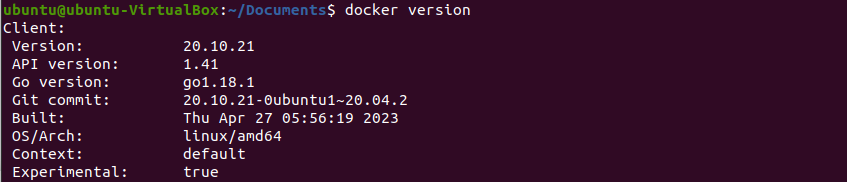

### 2. Rejestracja konta w DockerHub.

### 3. Pobierz hello-world, busybox, ubuntu lub fedora, mysql.
Wykorzystałam do tego komendę `sudo docker pull <nazwa_obrazu>`, po wykonaniu tej komendy Docker będzie powierał obraz z repozytorium DockreHub i zapisywał go na mojej maszynie wirtualnej. 

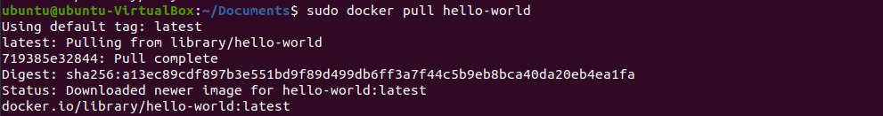
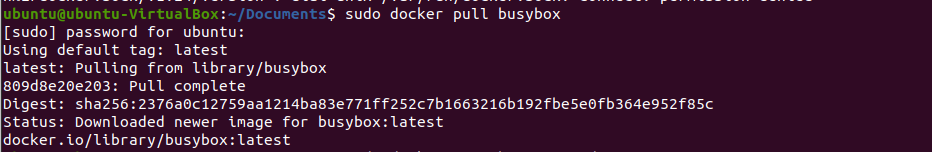
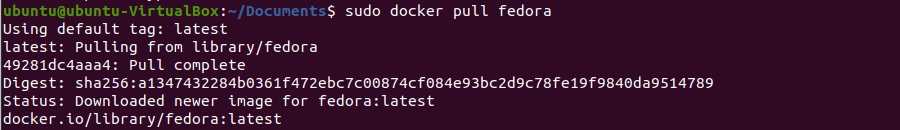
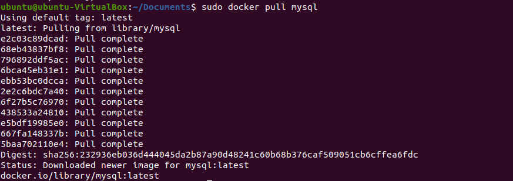

### 4. Uruchom busybox
**Efekt uruchomienia kontenera:** Za pomocą komendy `sudo docker run busybox` uruchomiłam kontener. Poniżej wynik działania polecenia. Wynikiem działania komendy, kontener busybox zostanie uruchomiony i natychmiast zakończony, ponieważ nie podałam żadnej komendy, która ma być wykonana wewnątrz kontenera. 
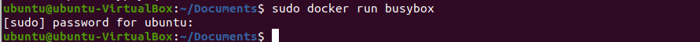

**Podłączenie się do kontenera interaktywnie, wywołanie numeru wersji:** tym razem uruchomiłam kontener poleceniem `sudo docker run -it busybox`, spowodowało to przejście w tyrb interaktywny, użyłam dwóch opcji `-i` - oznacza tryb interaktywny, umożliwia interakcję z kontenerem za pomocą wejścia/wyjścia oraz `-t` - oznacza alokację pseudoterminala, co umożliwia korzystanie z terminala wewnątrz kontenera. Następnie wpisując w pseudoterminalu `busybox` otrzymałam wylistowane informacje, m.in. numer wersji - `BusyBox v1.36.1`.
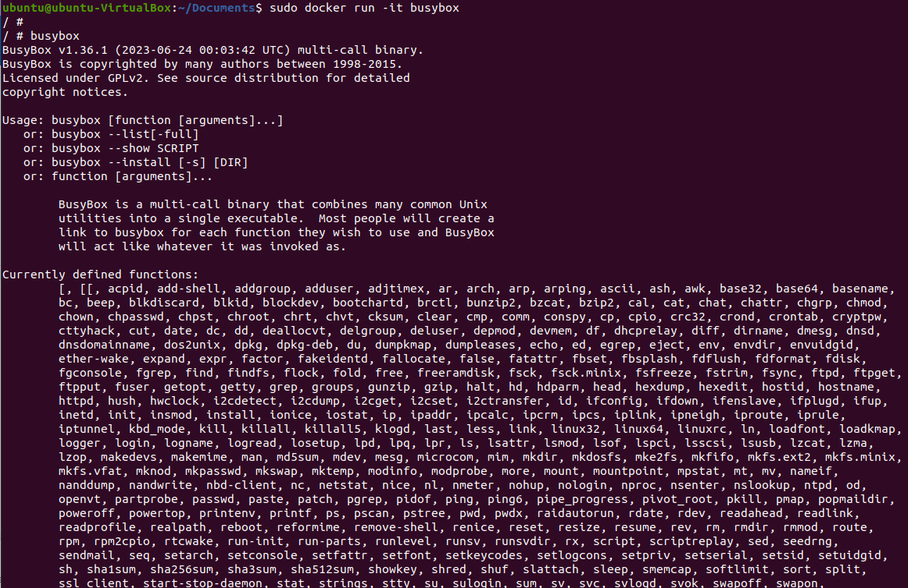

### 5. Uruchom "system w kontenerze"
Korzystając z polecenia `sudo docker run -it fedora` uruchomiłam kontener, następnie przy użyciu komendy `yum install -y procps-ng` zainstalowałam pakiet procps-ng zawierający narzędzia służące do monitorowania procesów systemowych. Wśród nich znajduje się m.in. `ps` - służące do wyświetlania informacji o procesach, `top` - monitorowanie aktywności systemowej oraz `kill` - zabijanie procesów. `yum` to menadżer pakietów stosowany w dystrybucjach opartych na Red Hat, takich jak np. Fedora. Służy do zarządzania instalacją, aktualizacją i usuwaniem pakietów.

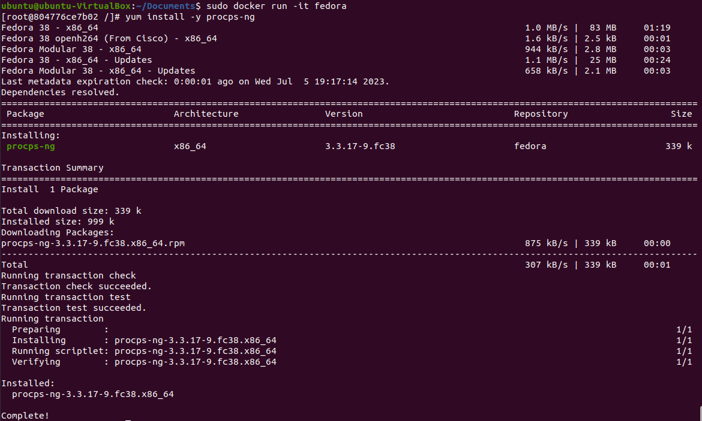

**Zaprezentuj PID1 w kontenerze**

Użyłam do tego polecenia `ps -p 1`, ps to polecenie służące do wyświetlenia informacji o aktualnie działających procesach. `-p 1` to opcja wskazująca, że chcemy wyświetlić informacje o procesie o konkretnym PID - 1.

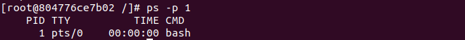

**zaktulizuj pakiety**
Do zaktualizowania pakietów użyłam polecenia `sudo apt-get update && sudo apt-get upgrade docker-ce`. Polecenie to składa się z dwóch członów, pierwszy `sudo apt-get update` aktualizuje listę dostępnych pakietów w systemie. System sprawdzi i pobierze aktualizacje. Polecenie `sudo apt-get upgrade docker-ce` wykonuje aktualizację pakietu Docker.

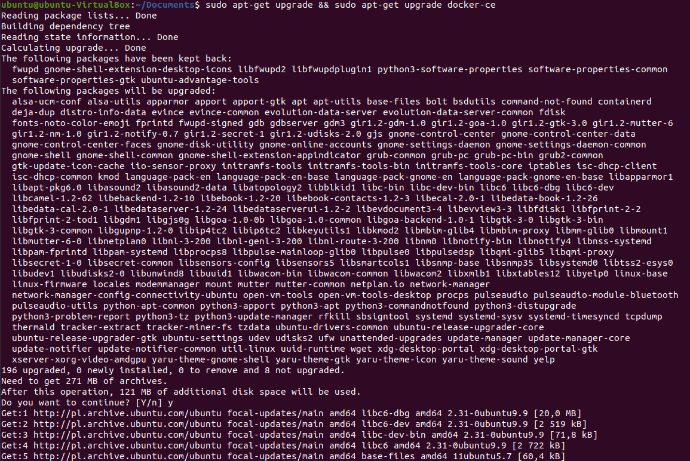

**wyjdź**
z pseudoterminala kontenera wychodzi się przy użyciu komendy `exit`.

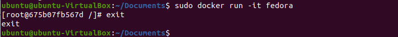

### 6. Stwórz własnoręcznie, zbuduj i uruchom prosty plik Dockerfile bazujący na wybranym systemie i sklonuj nasze repo.
W pierwszej kolejności stworzyłam folder roboczy (`mkdir dockfil`), weszłam do niego i utworzyłam Dockerfile (`touch Dockerfile`). 

W kolejnym kroku napisałam prosty plik Dockerfile: `FROM ubuntu` określa, że używamy obrazu ubuntu jako podstawy do budowy obrazu Dockera. `apt-get update` aktualizuje listę dostępnych pakietów w systemie, a poleceie `apt-get install -y git` instaluje pakiet Git wewnątrz kontenera. Dodanie parametru `-y` pozwala na automatyczne potwierdzenie, aby uniknąć zatrzymywania procesu instalacji w trakcie działania skryptu. `git clone ...` klonuje repozytowium z podanego adresu URL.

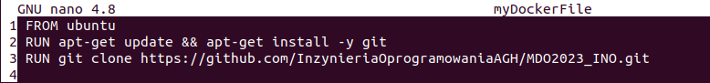

Budowanie pliku Dockerfile:

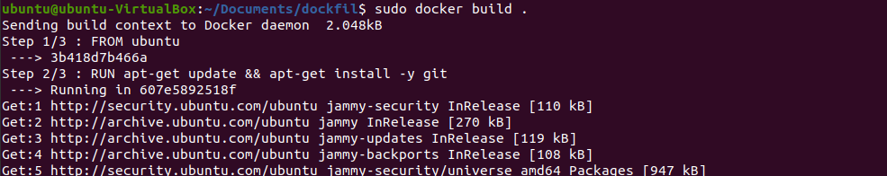

Następnie sprawdziłam, czy obraz się poprawnie zbudował - jak widzimy, po sprawdzeniu poleceniem `sudo docker images -a` pojawia się pierwszy na liście

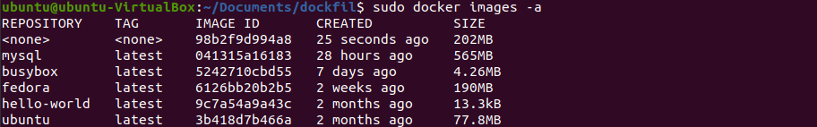

obraz pojawia się na liście, jednak nie został poprawnie zbudowany, w trakcie budowania pojawił się błąd:

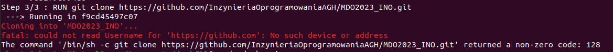

co w efekcie skutkowało nieudaną próbą uruchomienia kontenera:

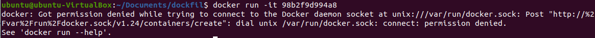

nie byłam więc w stanie wykonać punktów "sprawdź, że obraz będzie miał Git-a i zweryfikuj, że jest tam ściągnięte nasze repozytorium.

### 7. Pokaż uruchomione kontenery, wyczyść je.
Za pomocą polecenia `sudo docker ps -a` wyświetliłam wszystkie kontenery.

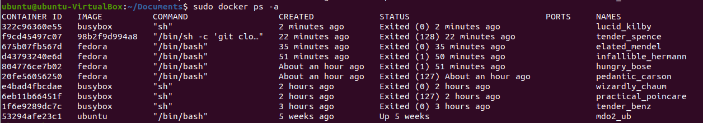

### 8. Wyczyść obrazy
KOntenery i obrazy wyczyściłam używając jednej komendy `sudo docker container prune`. Operacja ta wymagała potwierdzenia. Polecenia używa się w celu oczyszczenia zasobów w Dockerze. Wykonanie tego polecenia spowoduje usunięcie wszystkich nieaktywnych kontenerów, co powoduje zwolnienie miejsca na dysku. 

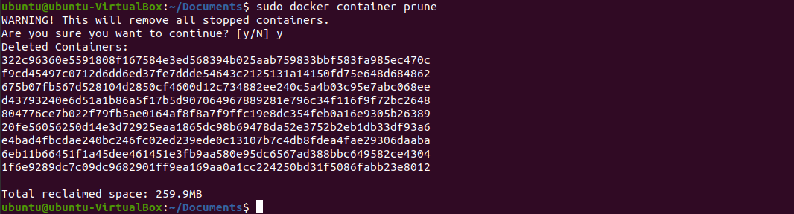

