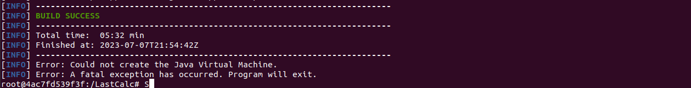
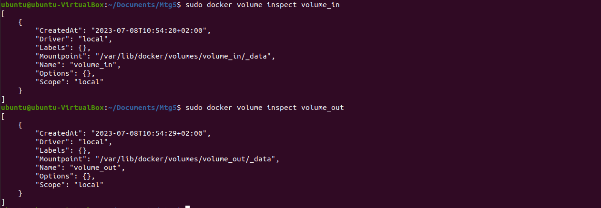
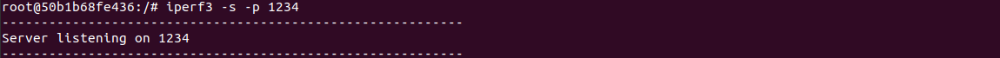
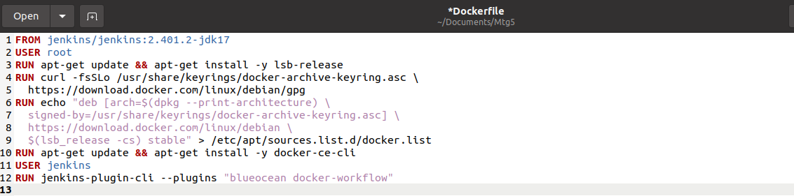

| Imię i nazwisko | Grupa |

| Dominika Kicilińska | 01 |

# Sprawozdanie nr 2

## **Wybór oprogramowania na zajęcia**

## Zadanie 1 - sklonowanie repozytorium, przygotowanie wszystkich potrzebnych plików

Repozytorium, jakie zdecydowałam się wybrać: https://github.com/sanity/LastCalc. Jest ot repozytorium, które spełnia wszystkie potrzebne wymagania - dysponuje otwartą licencją, jest umieszczone wraz ze swoimi narzędziami Makefile - jest możliwe uruchomienie w repozytorium `make`, `build`, `make test` (uruchomienie aplikacji i testów). 
Repozytorium sklonowałam do swojej maszyny wirtualnej przy użyciu polecenia `git clone`.

Zgodnie ze wskazówkami właściciela repozytorium, doinstalowałam środowisko Java oraz Mavena w celu przeprowadzenia budowania i testowania. Po zainstalowaniu wymaganych zależności sprawdziłam poprawność ich wersji.

**Środowisko Java zainstalowałam przy użyciu polecenia `sudo apt-get install default-jdk`**

sprawdzenie wersji:

**Mavena zainstalowałam za pomocą polecenia `sudo apt-get install maven`**

sprawdzenie wersji:

## Zadanie 2 - uruchomienie builda

Zgodnie z instrukcją w repozytorium, do przeprowadzenia builda użyłam polecenia `mvn appengine:devserver`. Testy wykonały się pomyślnie zarówno w trakcie builda, jak i po wywołaniu polecenia `mvn test`, program mimo początkowych warningów zbudował się poprawnie.

**Build:**

**testy:**

## **Przeprowadzenie buildu w kontenerze**

Do wykonania builda wybrałam kontener `ubuntu`. Początkowo miałam problem z zainstalowaniem w nim środowiska Java oraz Mavena, jednak po zastosowaniu komendy `apt-get update` wszystko się poprawnie zainstalowało. Zainstalowałam również gita poleceniem `apt-get install git`.

instalacja javy:

instalacja mavena:

instalacja gita:

Kolejnym krokiem było sklonowanie repozytorium które zrobiłam wykorzystując polecenie `git clone`:

Builda oraz testy, tak jak poprzednio przeprowadziłąm przy użyciu poleceń `mvn appengine:devserver` oraz `mvn test`. Budowanie oraz testy przebiegły poprawnie.

## Zadanie 1 - przygotowanie plików Dockerfile

Stworzenie pliku Dockerfile przeprowadzającego wszystkie kroki aż do builda. Plik Dockerfile utworzyłam przy pomocy polecenia `touch Dockerfile`.

**treść pierwszego Dockerfile:**
Obraz bazowy określiłam jako ubuntu, a następnie rozpisałam wszystkie kroki, które manualnie wpisywałam w powyższych punktach, w kroku pierwszym instalacja wszystkich potrzebnych zależności: Java, Maven i git, następnie sklonowanie repozytorium, a w ostatnim kroku przejście do utworzonego katalogu i uruchomienie builda.

Plik zbudowałam za pomocą polecenia `sudo docker build .`

Po wejściu do kontenera widzimy utworzony katalog `LastCalc` wraz z całą zawartością, zainstalowanego gita, Mavena i Javę.

**treść drugiego Dockerfile:**
Pierwszą czynnością, jaką zrobiłam była zmiana nazwy utowrzonego wcześniej kontenera, użyłam do tego polecenia `sudo docker image tag <stara nazwa> <nowa nazwa>`

następnie utworzyłam drugi plik Dockerfile `touch Dockerfile_2`. w pierwszej linii podaję uprzednio zbudowany kontener, natomiast druga linia zawiera polecenie przejścia do odpowiedniego katalogu i przeprowadzenie testów.

Następnie użyłam komendy `sudo docker build -f Dockerfile_2`. Użyłam opcji `-f` aby wybrać odpowiedni Dockerfile. Wynikiem tego jest uruchomiony kontener, w którym działa nasza aplikacja.

Również w tym przypadku zmieniłam nazwę:

Na koniec uruchamiłam kontener w trybie interaktywnym i sprawdziłam obecność wyszstkich niezbędnych elementów.

# Sprawozdanie nr 2 cd. - dodatkowa terminologia w konteneryzacji, instancja Jenkins

## **Zachowanie stanu**

## Zadanie 1 - zachowywanie stanu
1. Po zapoznaniu się z dokumentacją https://docs.docker.com/storage/volumes/ i zabrałam się za przygotowanie woluminów wejściowego - `volume_in` i wyjściowego - `volume_out`. Użyłam polecenia `sudo docker volume create <nazwa volumina>` i wyświetliłam za pomocą `sudo docker volume ls`.

Użyłam też polecenia `sudo docker volume inspect`, żeby sprawdzić gdzie dokładnie znajdują się woluminy - przyda mi się to w kolejnym kroku, gdzie będzuemy chceli znać ścieżki do naszych woluminów. 

2. Podłączyłam woluminy do kontenera bazowego - `ubuntu` za pomocą polecenia `sudo docker run -it --name woluminy --mount source=volume_in,destination=/volume_in --mount source=volume_out,destination=/volume_out ubuntu`. Poszczególne elementy polecenia: opcja `mount` definiuje montowanie woluminów o nazwach `volume_in` oraz `volume_out`. Opcja `source` wskazuje na nazwę woluminu, a `destination` określa docelową ścieżkę wewnątrz kontenera. `destination=/volume_in` oznacza, że wolumin bedzie dostepny w kontenerze pod ścieżką `/volume_in`. `ubuntu` to nazwa obrazu, który zostanie użyty do uruchomienia kontenera. 

3. Postanowiłam, że będę przeprowadzać build aplikacji wybranej w poprzednim laboratorium, dlatego doinstalowałam środowisko Javy i Mavena, nie istalowałam jednak gita.

4. W kolejnym kroku chciałam sklonować repozytorium na volumin wejściowy. W tym celu otworzyłam nowe okno terminala i bazując na wcześniej sprawdzonym adresie woluminu `volume_in`: `/var/lib/docker/volumes/volume_in/_data` przeszłam do odpowiedniego katalogu `var/lib` - nie mogłam przejść do dalszych katalogów ze względu na brak dostępu. Z tego miejsca mogłam jednak sklonować repozytorium do woluminu. 

5. Następnie wróciłam do kontenera i wyświetliłam zawartość folderu `volume_in` - repozytorium było tam sklonowane. 

6. Uruchomiłam builda poleceniem `mvn appengine:devserver`.

7. W ostatnim kroku przeniosłam utworzony w czasie builda katalog `target` z woluminu wejściowego `volume_in` na wolumin wyjściowy `volume_out` poleceniem `mv ./volume_in/target ./volume_out/`.

## Zadanie 2 - eksponowanie portów

1. W pierwszym kroku zapoznałam się z dokumentacją dostępną pod linkiem https://iperf.fr/. Następnie uruchomiłam w trybie interaktywnym kontener ubuntu i zainstalowałam w nim serwer `iperf3` poleceniem `apt install iperf3`.

2. W uruchomionym kontenerze uruchomiłam serwer iperf3 oraz rozpoczęłam nasłuchiwanie na porcie `1234`. Użyłam do tego polecenia `iperf3 -s -p 1234`. Opcja `-s` oznacza uruchomienie w tybie nasłuchu, natomiast opcja `p` oznacza przypisanie portu. 

3. Następnie uzyskałam adres IP kontenera, można to zrobić wpisując polecenie `sudo docker inspect <id kontenera>` jednak wtedy trzeba się przedostać przez wszystkie informacje o kontenerze lub można użyć polecenia `sudo docker inspect -f '{{range.NetworkSettings.Networks}}{{.IPAdderss}}{{end}} <id kontenera>`.

4. Uworzyłam drugi kontener poleceniem `sudo docker run -it ubuntu` oraz zainstalowałam w nim iperf3.

5. Na uruchomionym kontenerze wpisałam polecenie `iperf3 -c <adres_ip_pierwszego kontenera> -p 1234`. Polecenie to wykonuje test wydajności sieciowej łącząc klienta iperf3 z serwerem iperf3 o podanym adresie IP na podanym porcie.

6. Wyniki połączenia są również zapisane na pierwszym kontenerze, który był naszym serwerem:

7. Kolejny etap laboratorium to przygotowanie dedykowanej sieci mostkowej. Na początku zapoznałam się z dokumentacją https://docs.docker.com/engine/reference/commandline/network_create/. Następnie utworzyłam za pomocą polecenia `sudo docker network create --driver bridge mybridge` sieć mostkową o nazwie `mybridge`.

8. Sprawdziłam nazwy kontenerów za pomocą polecenia `sudo docker ps` i przyłączyłam kontenery do sieci używając polecenia `sudo docker network connect <nazwa sieci> <nazwa kontenera>`. 

9. Za pomocą polecenia `sudo docker network inspect <nazwa sieci>` sprawdziłam, czy kontenery zostały podłączone do sieci.

10. W kolejnym kroku połączyłam się z serwerem z pierwszego kontenera z poziomu hosta przy użyciu polecenia `iperf3 -c <adres IP kontenera> -p 1234`. Połączenie przebiegło sprawnie i bez problemów. 

połączenie ze strony serwera w kontenerze:

11. Aby podjąć próbę połączenia się z serwerem spoza hosta pobrałam iperf3 na Windows. W wierszu polecenia wpisałam polecenie `iperf3 -c 172.17.0.3 -p 1234`. Wynikiem jest błędna próba połączenia.

## Zadanie 3 - Instancja Jenkins

1. Zapoznałam się z dokumentacją dostępną na stronie https://www.jenkins.io/doc/book/installing/docker/ oraz wykonałam zadania opisane w instrukcji. Pierwszym krokiem było utworzenie sieci mostkowej za pomocą polecenia `sudo docker network create jenkins`.

2. Następnie, zgodnie z instrukcją wpisałam polecenie `sudo docker run --name jenkins-docker --rm --detach --privileged --network jenkins --network-alias docker --env DOCKER_TLS_CERTDIR=/certs --volume jenkins-docker-certs:/certs/client --volume jenkins-data:/var/jenkins_home --publish 2376:2376 docker:dind --storage-driver overlay`. Znaczenie wszystkich użytych w poleceniu parametrów jest dokładnie opisane w dokumentacji na stronie.

3. W następnym kroku przygotowałam plik Dockerfile, do którego skopiowałam treść z dokumentacji.

4. W kolejnym kroku zbudowałam Dockerfile za pomocą polecenia `sudo docker build -t myjenkins .` dodając opcją `-t` tag `myjenkins`.

5. Uruchomiłam zbudowany obraz za pomocą polecenia `sudo docker run --name jenkins-blueocean --restart=on-failure --detach --network jenkins --env DOCKER_HOST=tcp://docker:2376 --env DOCKER_CERT_PATH=/certs/client --env DOCKER_TLS_VERIFY=1 --publish 8080:8080 --publish 50000:50000 --volume jenkins-data:/var/jenkins_home --volume jenkins-docker-certs:/certs/client:ro myjenkins`, na końcu umieszczając nazwę zbudowanego uprzednio obrazu.

6. Następnie wpisałam w przeglądarkę adres https://localhost:8080 i skonfigurowałam swojego Jenkinsa. Zainstalowałam sugerowane wtyczki i zmieniłam hasło do logowania. URL Jenkinsa ustawiłam na http://localhost:8080/ 

